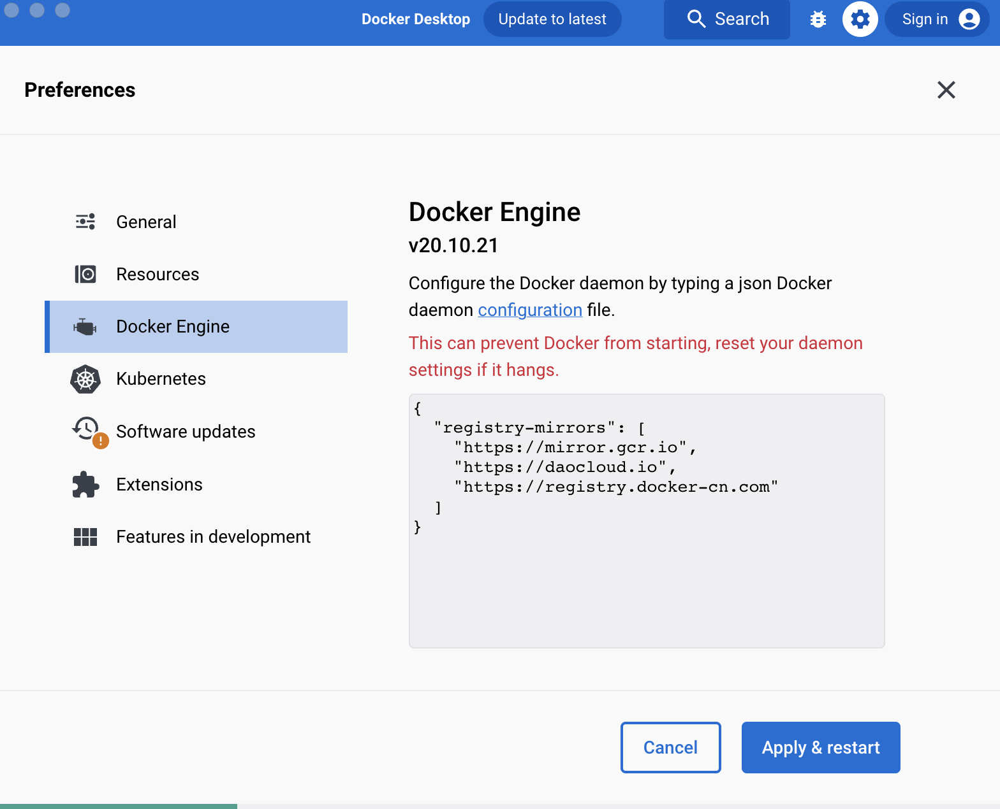

#  Настраиваем docker registry mirrors

## Пример конфигурации зеркал
```
"registry-mirrors": [
    "https://mirror.gcr.io",
    "https://daocloud.io",
    "https://registry.docker-cn.com"
]
```

## Добавляем конфигурацию
Необходимо добавить конфигурацию из [примера](daemon.json) и рестартануть docker.

### Способ 1. Через интерфейс docker desktop:
Переходим в Preferences, вкладка Docker Engine:

Добавляем конфигурацию, нажимаем Apply & restart.

### Способ 2. Напрямую в файл daemon.json:
Данный файл конфигурации, в зависимости от операционной системы и типа установки docker, можно найти по следующим путям:
- ~/.docker/daemon.json
- /etc/docker/daemon.json

Добавляем конфигурацию и рестартуем docker.

## Проверяем
Необходимо запустить терминал и выполнить docker pull любого образа, который отсутствует локально:

```
onakrainikoff ~ % docker pull nginx

Using default tag: latest
latest: Pulling from library/nginx
09f376ebb190: Already exists 
a11fc495bafd: Pull complete 
933cc8470577: Pull complete 
999643392fb7: Pull complete 
971bb7f4fb12: Pull complete 
45337c09cd57: Pull complete 
de3b062c0af7: Pull complete 
Digest: sha256:a484819eb60211f5299034ac80f6a681b06f89e65866ce91f356ed7c72af059c
Status: Downloaded newer image for nginx:latest
docker.io/library/nginx:latest
```